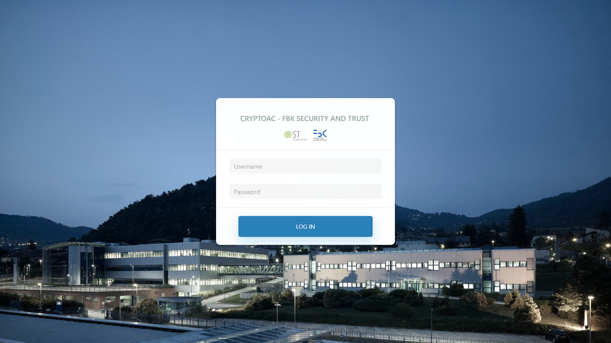
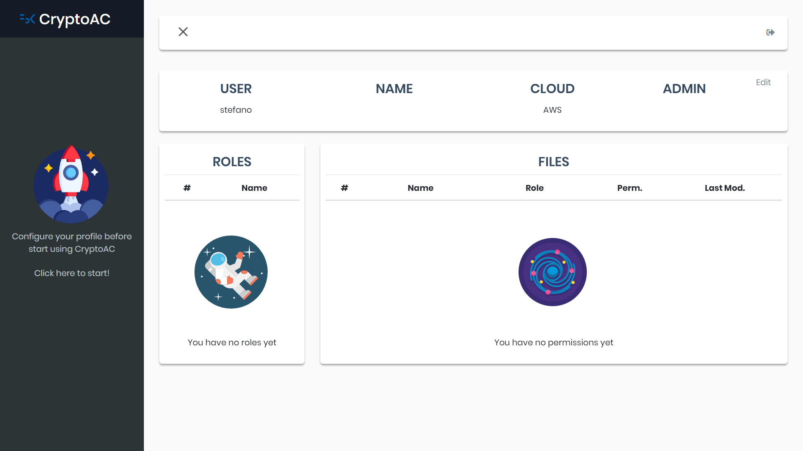
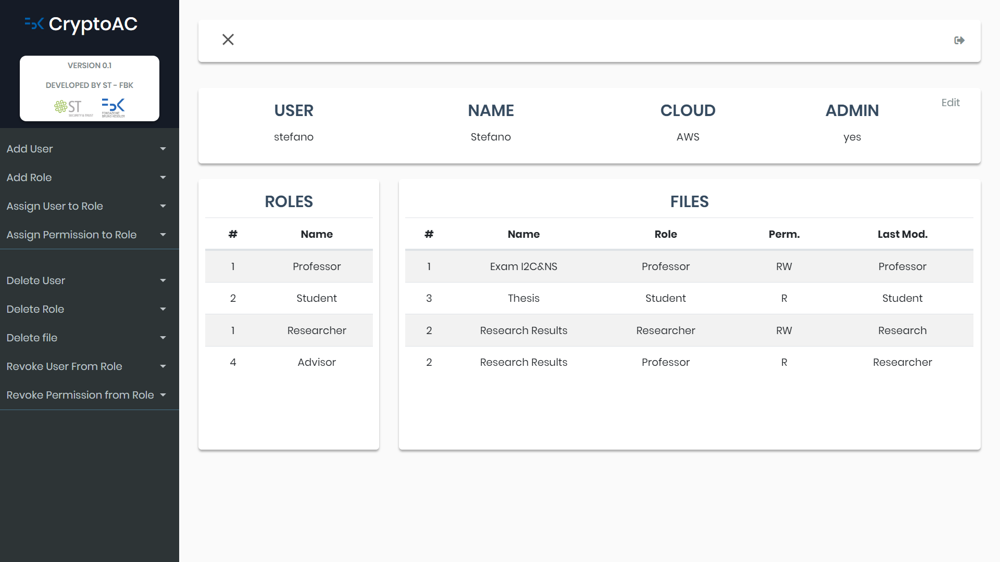
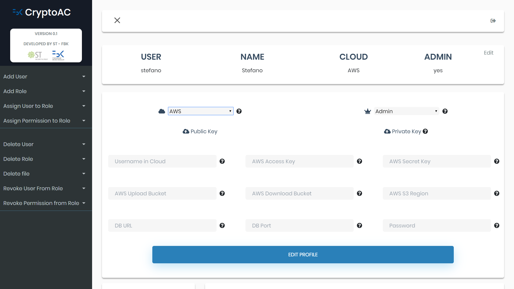

# Master Thesis #

### Master Thesis, Computer Science ICT Innovation Security&Privacy, University of Trento - DISI, 2019
#### Supervisor: Ranise Silvio
#### Co-supervisor: Carbone Roberto
#### Student: Berlato Stefano
#### Title: A Pragmatic Approach to Handle “Honest but Curious” Cloud Service Providers: Cryptographic Enforcement of Dynamic Access Control Policies

# Abstract

Cryptographic Access Control is the natural solution to allow companies to store sensitive data in the Cloud while preserving confidentiality and the possibility to let employees share resources. While many researches focused on this topic, the vast majority proposed only abstract schemes. Few studies developed even a working prototype and none deeply studied a deployment in a realistic use case by considering concrete issues like keys management, robustness or scalability. In this thesis, we filled the gap between these abstract schemes and an actual deployment. We addressed real-world issues like keys management, robustness and scalability rather than focusing high-level issues only. Concretely, we chose a state-of-the-art cryptographic access control scheme and extended it to deliver a fully-working implementation. We formulated four high-level properties to derive low-level assumptions and requirements. Furthermore, we formalized two degrees of freedom and presented twelve different architectures, explaining in detail advantages and drawbacks. To finalize to our discussion, we implemented a cryptographic access control scheme running in a Docker container and interacting with Amazon Web Services. To cover as many use cases as possible, we designed it so to interface with multiple Cloud Service Providers and support multiple architectures with a simple, if not completely null, configuration effort. Summarizing, our work provided a detailed view of the challenges and conditions that can serve as guidelines also for other future implementations of cryptographic access control schemes

## How to Run

Since the software is part of an internal project in FBK - Fondazione Bruno Kessler, contact me if interested.

## Screenshots

